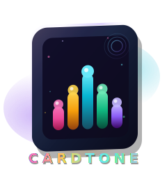

# CardTone



NFC-driven media player for kids, with real-time parental control.


---

CardTone is a dual-app parental control system. A **parent device** manages NFC cards, media, and safety settings. A **kid device** plays content the moment a physical card is tapped — no browsing, no app stores, no surprises.

---

## Apps

### `cardtone-parent` — The Control Center

| Feature | Details |
| -------- | ------- |
| **Link Devices** | Scan a kid device's QR code to pair. The first parent to link becomes the **Master Parent ⭐** |
| **Master Parent** | Only the master parent can approve additional parents — prevents a child from linking unauthorized devices |
| **Card Management** | Create cards and assign NFC tag IDs → media URLs (audio, video, YouTube, Spotify, Google Drive) |
| **Remote Control** | Play, pause, stop playback on the kid's device from anywhere in real-time |
| **Volume Limit** | Set the maximum volume the kid's device can reach |
| **Kiosk Mode** | Remotely lock the kid into the CardTone app — they can't exit |
| **Session Limits** | Set a daily time limit; the session auto-locks when the timer runs out |
| **Bedtime** | Define bedtime hours — the kid's device locks itself automatically |
| **Master NFC Cards** | Configure special cards that unlock kiosk mode or lock the session on scan |
| **PIN Management** | Set a 6-digit PIN for local kiosk unlock |
| **Activity Log** | View a history of scanned cards and playback events per kid |

### `cardtone-kid` — The Player

| Feature | Details |
| -------- | ------- |
| **NFC → Play** | Tap any configured card to instantly start the assigned media |
| **Now Playing** | Shows the title of the currently active card (e.g. "🎵 Elsa's Song") with an animated equalizer |
| **Universal Player** | Audio (MP3/AAC/WAV), Video (MP4/HLS), YouTube, Spotify/Anghami via WebView, Google Drive |
| **Error Feedback** | If a card has no URL or the URL is invalid, a friendly message is shown instead of crashing |
| **Kiosk Mode** | Locks the device to the app; always-on screen via wakelock |
| **Master Cards** | Special NFC cards for kiosk unlock or session lock |
| **Bedtime Lock** | Device locks itself automatically at configured bedtime |
| **Pairing** | QR code displayed on first launch for the parent to scan |
| **Master Parent Lock** | Cannot add new parents from the kid device once a master parent exists |

---

## Getting Started

### 1 — Backend (Supabase)

1. Create a free project at [supabase.com](https://supabase.com).
2. Open **SQL Editor** and run the full schema from [SUPABASE_SETUP.md](SUPABASE_SETUP.md).
3. Go to **Settings → API** and copy your **Project URL** and **anon key** into:
   - `cardtone-kid/lib/services/supabase_config.dart`
   - `cardtone-parent/lib/services/supabase_config.dart`

### 2 — Run the Apps

```bash
# Kid app
cd cardtone-kid
flutter pub get
flutter run   # Requires a physical Android device for NFC + Kiosk

# Parent app
cd cardtone-parent
flutter pub get
flutter run
```

### 3 — Pair Devices

1. On the kid device, tap the **QR code icon** — a pairing code appears.
2. In the parent app, tap **+** and scan the QR code.
   - The **first parent to scan becomes the Master Parent ⭐**.
3. Add cards in the parent app, assign media URLs.
4. On the kid device, tap an NFC card — content plays immediately.

---

## Tech Stack

| Layer | Technology |
| ----- | ---------- |
| Framework | Flutter 3.x (Dart) |
| Backend / Realtime | Supabase (PostgreSQL + Realtime subscriptions) |
| Auth | Supabase Magic Link / OTP email |
| State Management | `provider` 6.1 (`ChangeNotifier`) |
| Local Storage | `shared_preferences` 2.5 |
| NFC | `nfc_manager` 4.1, `flutter_nfc_kit` 3.6 |
| Media | `audioplayers` 6.6, `video_player` 2.11, `youtube_player_flutter` 9.1 |
| Web Content | `webview_flutter` 4.13 |
| QR | `qr_flutter` 4.1 (generate), `mobile_scanner` 7.2 (scan) |
| Screen Control | `wakelock_plus` 1.5, `kiosk_mode` 0.8 |
| SVG | `flutter_svg` 2.2 |

---

## Project Layout

```text
CardTone-Projekt/
├── assets/                    # Shared assets (logo-shared.svg)
├── cardtone-kid/              # Kid app (Flutter)
│   ├── assets/                # logo-kid.svg
│   └── lib/
│       ├── models/            # CardModel
│       ├── providers/         # AppState (ChangeNotifier)
│       ├── screens/           # KidsScreen, PairingScreen
│       ├── services/          # MediaService, NfcService, SyncService, KioskService, ...
│       └── theme/             # KidTheme (neumorphic design tokens)
├── cardtone-parent/           # Parent app (Flutter)
│   ├── assets/                # logo-parent.svg
│   └── lib/
│       ├── models/            # CardModel
│       ├── providers/         # AppState (ChangeNotifier)
│       ├── screens/           # ParentScreen, QRScannerScreen
│       ├── services/          # SyncService, SupabaseConfig
│       └── widgets/           # KioskModeControl, SessionLockControl, MasterKeyControl, ...
├── cardtone-website/          # Marketing website (HTML/CSS)
│   └── logo.svg               # Website logo
├── cardtone-box/              # KiCad PCB design (ESP32-S3 NFC reader)
├── db_migrations/             # SQL files for Supabase schema updates
├── Dockerfile.flutter         # Shared Flutter + Android SDK build image
├── docker-compose.yml         # Dev services (kid, parent, website)
├── build_release.ps1          # Windows release build script
├── SUPABASE_SETUP.md          # Full SQL schema and RLS policies
└── CONTRIBUTING.md            # Contributor guide
```

---

## Database Overview

| Table | Purpose |
| ----- | ------- |
| `kids` | Kid device profiles, settings, locks |
| `parents` | Parent accounts and linked kid IDs |
| `cards` | NFC card definitions (UID → media URL) |
| `commands` | Real-time command queue (play, pause, stop, lock) |
| `activity_logs` | Per-kid event history |
| `playback_state` | Live playback status synced from kid to parent |

See [SUPABASE_SETUP.md](SUPABASE_SETUP.md) for the full schema, RLS policies, and RPC functions.

---

## Documentation

| File | Description |
| ---- | ----------- |
| [SUPABASE_SETUP.md](SUPABASE_SETUP.md) | Database schema, RLS policies, migration guide |
| [CONTRIBUTING.md](CONTRIBUTING.md) | Environment setup, code conventions, PR workflow |
| [cardtone-kid/README.md](cardtone-kid/README.md) | Kid app features, code structure, bug history |
| [cardtone-parent/README.md](cardtone-parent/README.md) | Parent app features, code structure, bug history |
| [cardtone-kid/README_KIOSK.md](cardtone-kid/README_KIOSK.md) | Kiosk mode setup (ADB device owner, screen pinning) |
| [cardtone-kid/KIOSK_ALWAYS_ON.md](cardtone-kid/KIOSK_ALWAYS_ON.md) | Wakelock, foreground service, background execution |
| [cardtone-parent/REALTIME_SYNC.md](cardtone-parent/REALTIME_SYNC.md) | Real-time playback synchronization architecture |
| [cardtone-parent/MASTER_CARD_SYNC.md](cardtone-parent/MASTER_CARD_SYNC.md) | Master card reactive update testing guide |

## Downloads

Pre-built APKs are available in [`cardtone-website/`](cardtone-website/):

| App | File |
| --- | ---- |
| Kid app | `cardtone-website/CardTone-Kid.apk` |
| Parent app | `cardtone-website/CardTone-Parent.apk` |

---

Last updated: March 20, 2026
